

`Công ty TNHH Giải Pháp Kỹ Thuật Số DH - Mẫu: DH-02: Mô tả thay đổi hệ thống DHG.Hospital 3.1`

  
  <h1>HƯỚNG DẪN SỬ DỤNG</h1>  

#### CHỦ ĐỀ: CÀI ĐẶT ĐỒNG BỘ DỮ LIỆU POSTGRES REPLICATION

###### :eight_spoked_asterisk: Người lập: [**ÔNG TRIỆU HẬU**](https://github.com/ongtrieuhau)

###### :eight_spoked_asterisk: Ngày lập: **22/11/2023**

###### :eight_spoked_asterisk: Khách hàng: **Tất cả khách hàng sử dụng DHG.Hospital**

###### :eight_spoked_asterisk: Yêu cầu

- Cài postgres cùng phiên bản trên 2 máy chủ, lưu ý cấu hình 2 các thông số postgres phải giống nhau (như port, số kết nối,...) 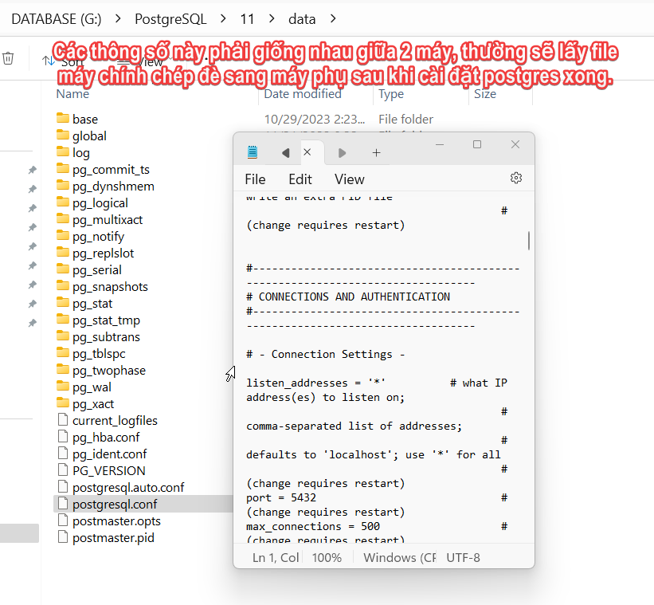
- Cấu hình share thư mục trên máy chính để máy phụ có thể truy cập được. (Nên tạo user mới `postgres_replication` trên máy chính với mật khẩu mặc định `Admin@123`, thêm xác thực với tài khoản này trên máy phụ - tránh khi người dùng thay đổi mật khẩu sẽ mất đồng bộ)

###### :eight_spoked_asterisk: Thêm xác thực bằng postgres_replication từ máy phụ tới máy chính (Thực hiện trên máy phụ)
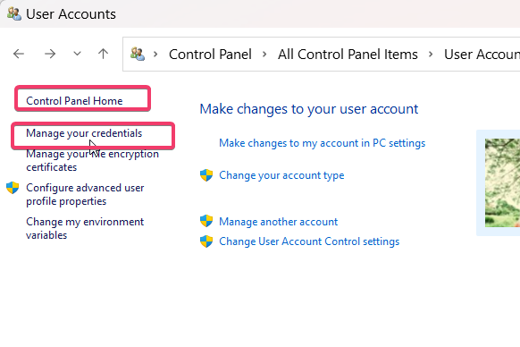
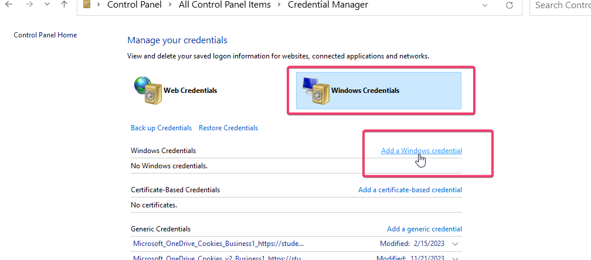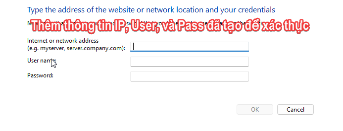

###### :eight_spoked_asterisk: Thực hiện đồng bộ
- Thực hiện mở chương trình đồng bộ tương ứng với máy chủ và máy phụ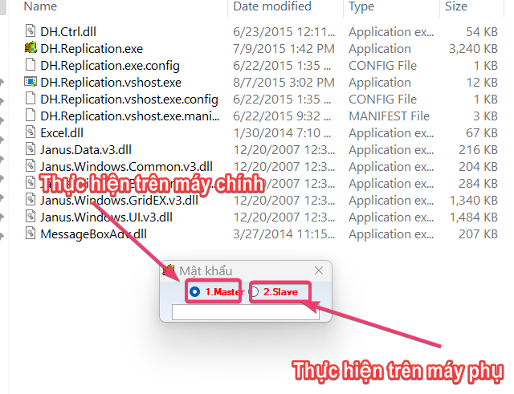
- Cấu hình các tham số trên máy chính
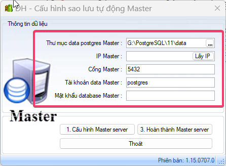
- Cấu hình các tham số trên máy phụ
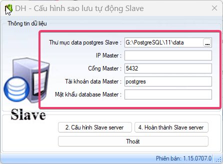
- Thực hiện theo các số thứ tự trên các form cấu hình (Thực hiện từ 1 -> 2 -> 3 -> 4)
`

  1. Cấu hình Master server (trên máy chính)
  2. Cấu hình Slave server (trên máy phụ)
  3. Hoàn thành Master server (trên máy chính)
  4. Hoàn thành Slave server (trên máy phụ)

`
- Xử lý lỗi khi kết thúc bước 2. Cấu hình Slave server (nếu có)
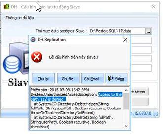
==> Vào thư mục cài đặt PostgreSQL trên máy chính xóa hết các tập tin trong thư mục `wal_archive_postgres_replication_first` sau đó tiếp tục thực hiện theo thứ tự trên.
 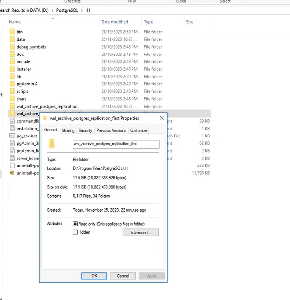
###### :eight_spoked_asterisk: Cấu hình cảnh báo trạng thái đồng bộ khi đăng nhập module admin
- Chỉnh dữ liệu dòng `admin_warning_replication` trong bảng dữ liệu `current.coderun` lên bằng `1`
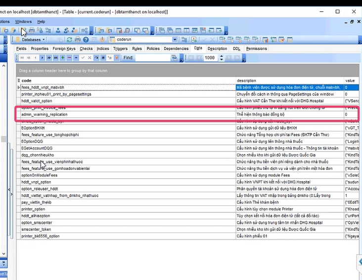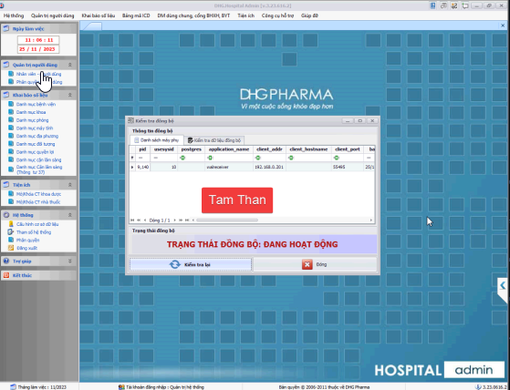

###### :eight_spoked_asterisk: Video hướng dẫn thực tế tại bệnh viện Tâm Thần Cần Thơ
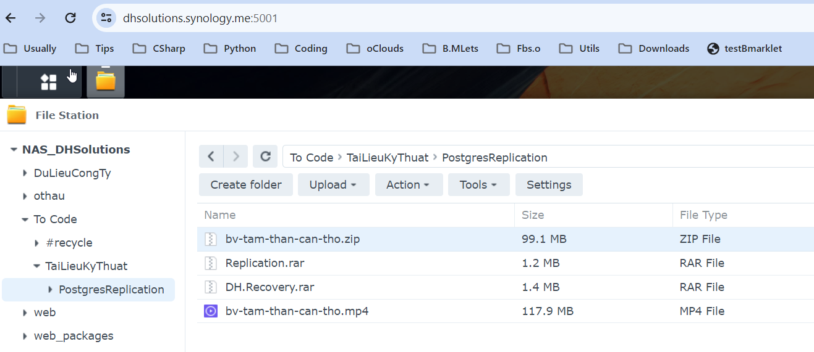

#### KẾT THÚC CHÚC THÀNH CÔNG!!!
