<div align="center">

`Công ty TNHH Giải Pháp Kỹ Thuật Số DH - Mẫu: DH-02: Mô tả thay đổi hệ thống DHG.Hospital 3.1`

</div>

<div align="center">
  
  <h1>HƯỚNG DẪN SỬ DỤNG</h1>  
</div>
<div align="center">

#### CHỦ ĐỀ: CÀI ĐẶT  WEBSERVICES CHO HỆ THỐNG TÍCH HỢP THANH TOÁN QRCODE

</div>

###### :eight_spoked_asterisk: Người lập: [**ÔNG TRIỆU HẬU**](https://github.com/ongtrieuhau)

###### :eight_spoked_asterisk: Ngày lập: **21/03/2024**

###### :eight_spoked_asterisk: Khách hàng tích hợp thanh toán QRCode

###### :eight_spoked_asterisk: Yêu cầu máy tính để chạy webservice

- Máy tính có kết nối Internet, cài window 64bit
- Nên cài đặt window server (hỗ trợ tối đa kết nối đến webservice)
- Cài đặt Git mới nhất tại [git-scm.com](https://git-scm.com/downloads) (Phải khởi động lại sau khi cài đặt)

###### :eight_spoked_asterisk: Bước 1: Cài đặt github-action-runner

- Mục đích: Lấy code trên github.com về máy hiện tại chạy webservice (Việc tạo repo và upcode sẽ do nhóm code thực hiện)
- Hướng dẫn dưới đây lấy ví dụ là cho Bệnh viện Quận 12 - kết nối BIDV
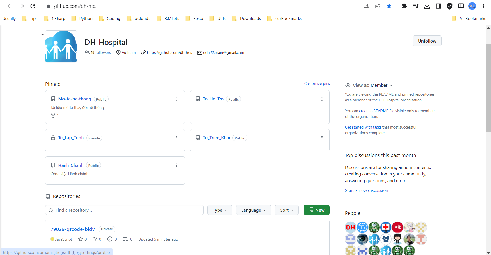
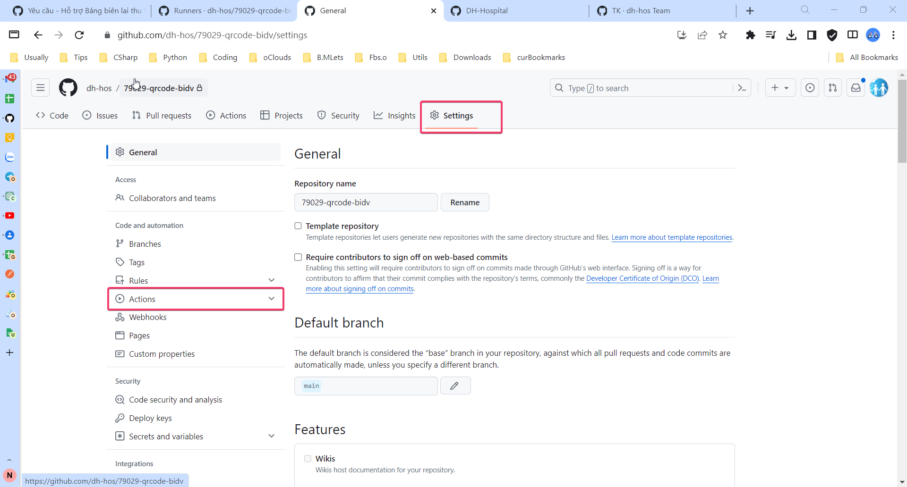
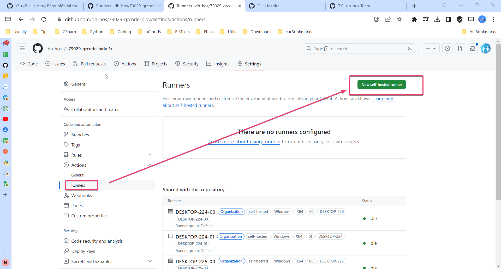
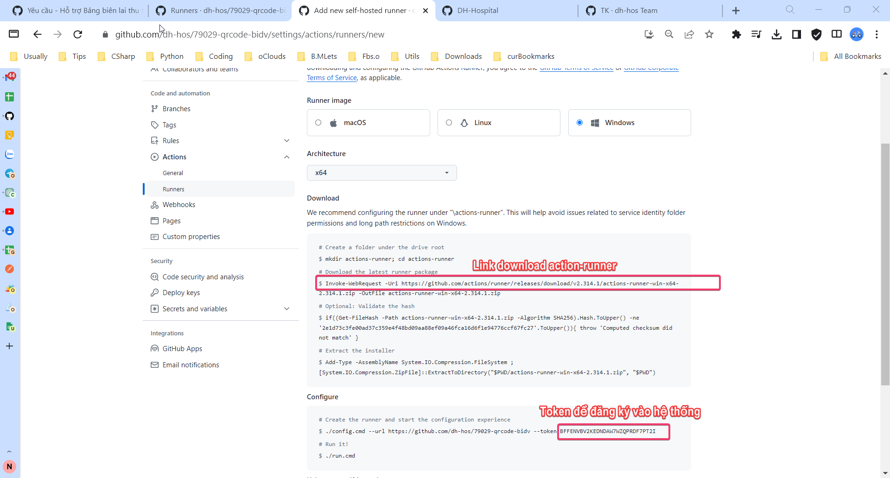
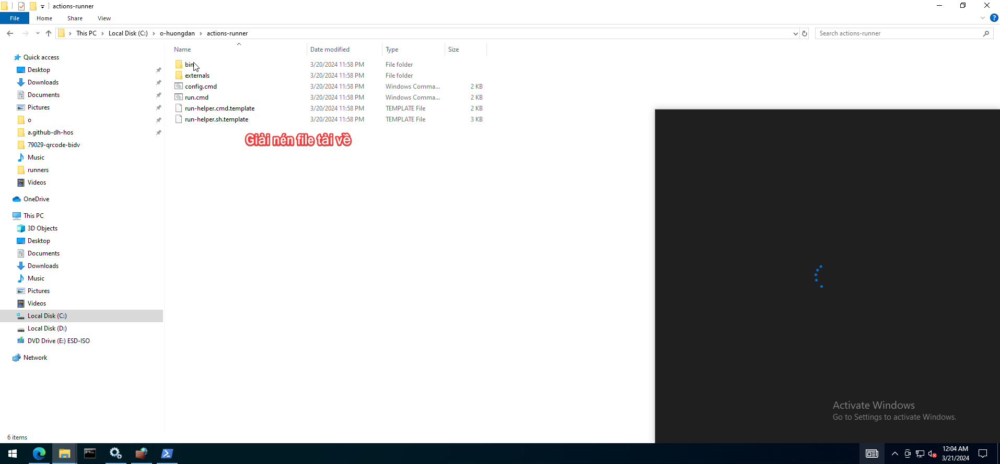
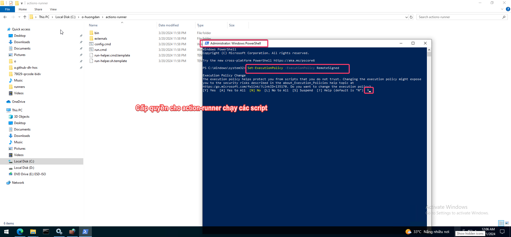

```Set-ExecutionPolicy -ExecutionPolicy RemoteSigned```

Tạo tập tin register-action.bat để thực hiện đăng ký, thay các tham số tương ứng
--url, --token, --labels vào trong thư mục giải nén phía trên.

```
for %%I in (.) do set CurrDirName=%%~nxI
echo %CurrDirName%
config.cmd --unattended --url https://github.com/dh-hos/79029-qrcode-bidv --token BFFENVBV2KEDNDAW7WZQPRDF7PT2I --runasservice --labels 79029-qrcode-bidv
```


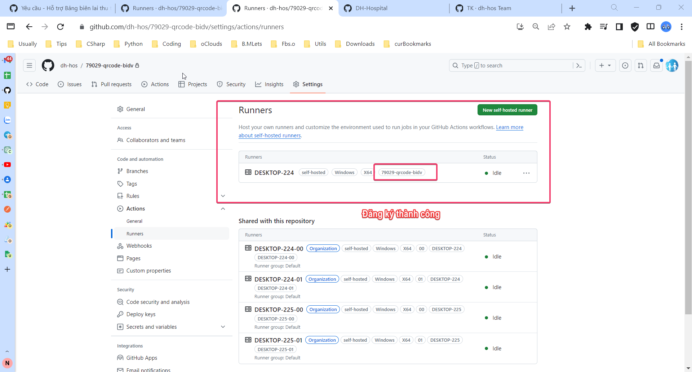
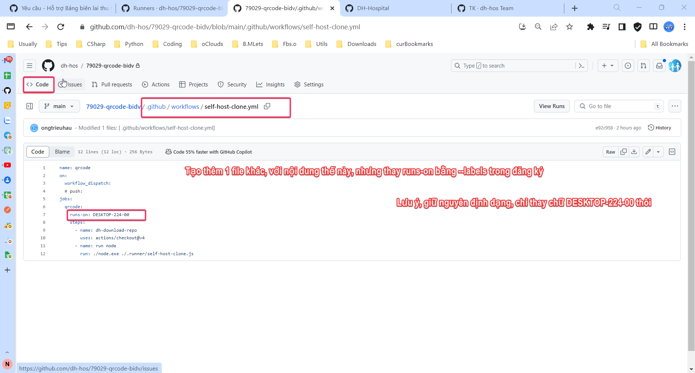
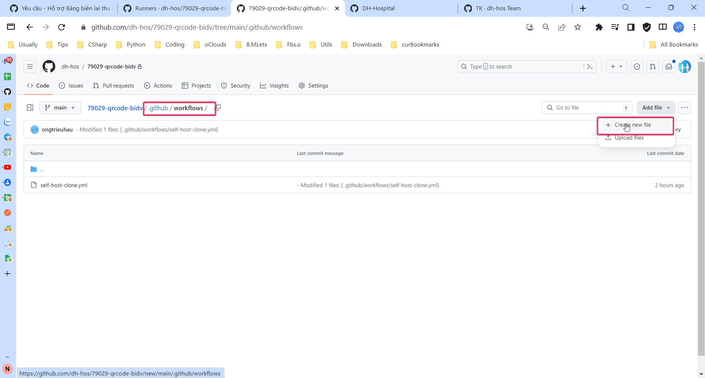
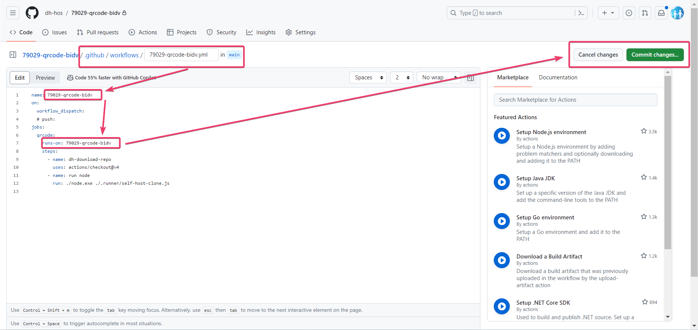
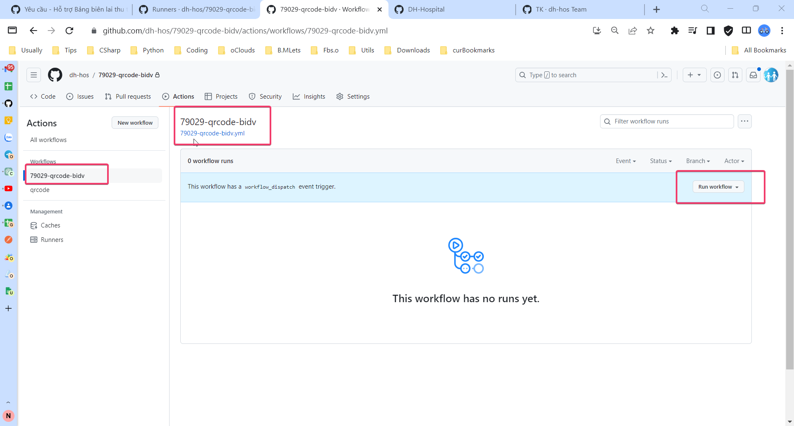
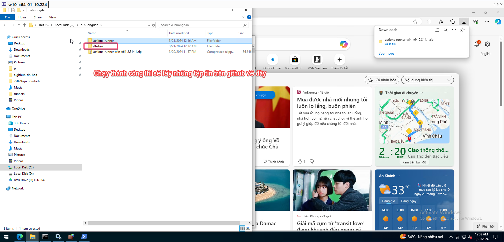

###### :eight_spoked_asterisk: Bước 2: Cài đặt webservices

- Khởi chạy dịch vụ webservice để nhận dữ liệu phía ngân hàng báo có về HIS
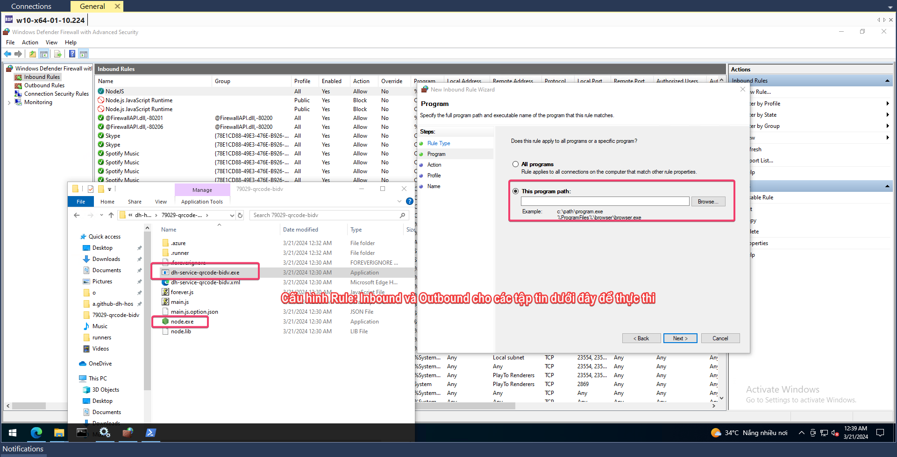
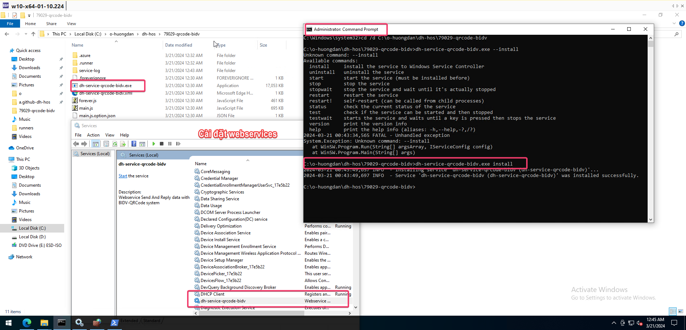
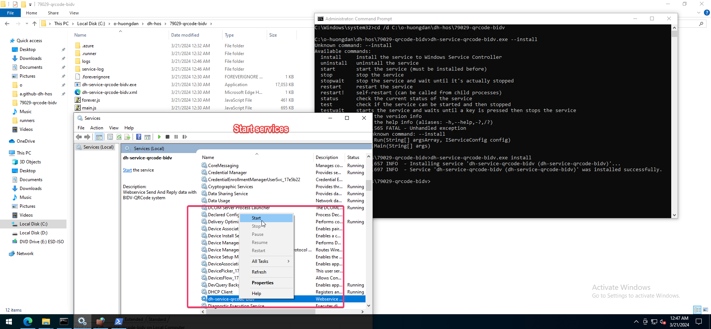
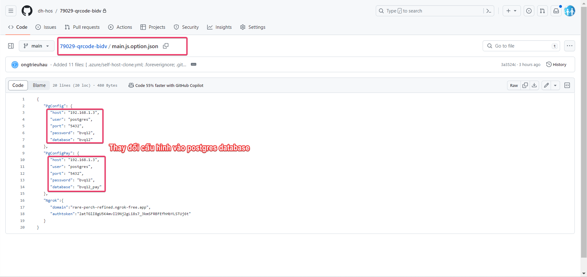

###### :eight_spoked_asterisk: Cập nhật option, các thông số kết nối, genQR


###### :eight_spoked_asterisk: Lưu ý

- Khi thay đổi các tập tin trên github.com, muốn thay đổi tới bệnh viện thì phải thực hiện chạy lại các workflow


###### :eight_spoked_asterisk: Danh sách Repository hỗ trợ các bệnh viện

- [BV Nội Tiết - Quảng Ngãi 51214](https://github.com/dh-hos/51214-qrcode-vietin)
- [BV Quận 12 - Hồ Chí Minh 79029](https://github.com/dh-hos/79029-qrcode-bidv)
- [BV Tim Mạch - Cần Thơ 92001](https://github.com/dh-hos/92001-qrcode-vietin)
- [BV Bình Long - Bình Phước 70071](https://github.com/dh-hos/70071-qrcode-agribank)
- [BV Phước Long - Bạc Liêu 95006](https://github.com/dh-hos/95006-qrcode-vietin)
- [BV Ung Bướu - Cần Thơ 92086](https://github.com/dh-hos/92086-qrcode-sacombank)
- [BV YHCT - Cần Thơ 92013](https://github.com/dh-hos/92013-qrcode-hdbank)

#### KẾT THÚC CHÚC THÀNH CÔNG
