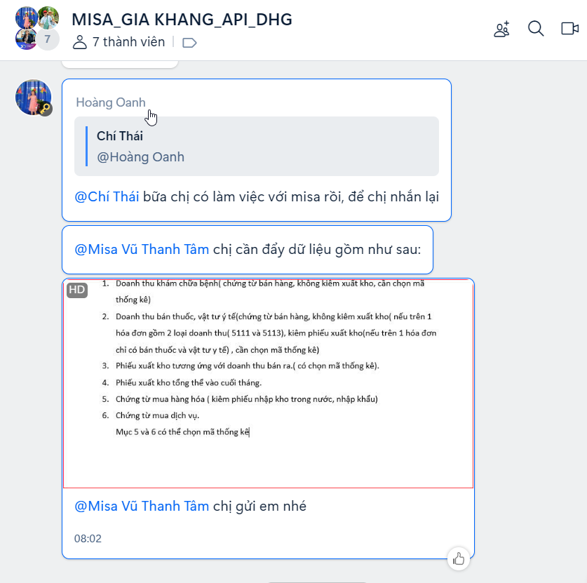

`Công ty TNHH Giải Pháp Kỹ Thuật Số DH - Mẫu: DH-02: Mô tả thay đổi hệ thống DHG.Hospital 3.1`

  
  <h1>PHIẾU MÔ TẢ THAY ĐỔI HỆ THỐNG</h1>  

#### CHỦ ĐỀ: KẾT NỐI MISA - PHÚC GIA KHANG

###### :eight_spoked_asterisk: Người lập: [ÔNG TRIỆU HẬU](https://github.com/ongtrieuhau)

###### :eight_spoked_asterisk: Ngày lập: **2024-10-19**

###### :eight_spoked_asterisk: Khách hàng: **PHÚC GIA KHANG**

###### :eight_spoked_asterisk: Yêu cầu phát sinh: Gửi dữ liệu lên hệ thống MISA

###### :eight_spoked_asterisk: Thông tin liên hệ:

- [Nhóm Zalo](https://zalo.me/g/rfempi753)
- 

###### :eight_spoked_asterisk: Tài liệu kết nối

- [Khảo sát API XLSX](<tep-ho-tro/MISA_Bảng thông tin khảo sát API_CTY PHÚC GIA KHANG 1_15.10.2024.xlsx>)
- [Link API](https://actdocs.misa.vn/g1/graph/ACTOpenAPIHelp/index.html)

###### :eight_spoked_asterisk: Danh mục kết nối

- 
