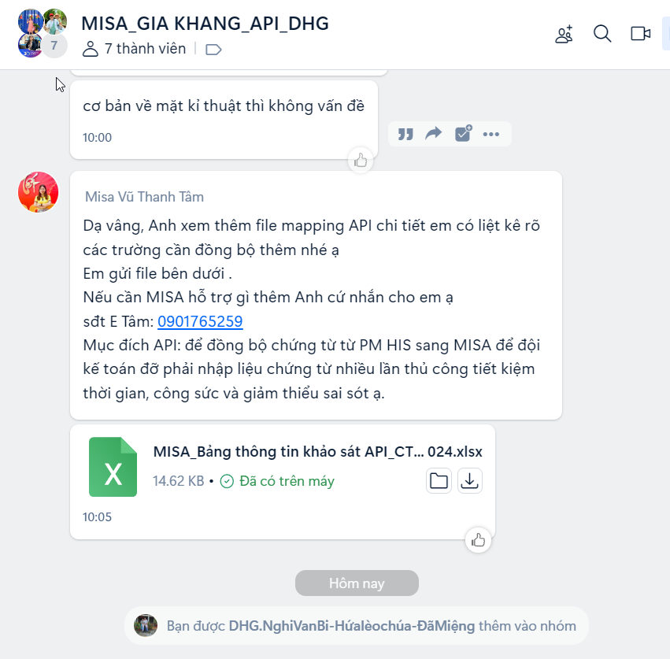

`Công ty TNHH Giải Pháp Kỹ Thuật Số DH - Mẫu: DH-02: Mô tả thay đổi hệ thống DHG.Hospital 3.1`

  
  <h1>PHIẾU MÔ TẢ THAY ĐỔI HỆ THỐNG</h1>  

#### CHỦ ĐỀ: KẾT NỐI MISA - PHÚC GIA KHANG

###### :eight_spoked_asterisk: Người lập: [ÔNG TRIỆU HẬU](https://github.com/ongtrieuhau)

###### :eight_spoked_asterisk: Ngày lập: **2024-10-19**

###### :eight_spoked_asterisk: Khách hàng: **PHÚC GIA KHANG**

###### :eight_spoked_asterisk: Yêu cầu phát sinh: Gửi dữ liệu lên hệ thống MISA

###### :eight_spoked_asterisk: Thông tin liên hệ:

- [Nhóm Zalo](https://zalo.me/g/rfempi753)
- 

###### :eight_spoked_asterisk: Tài liệu kết nối

- [Khảo sát API XLSX](<tep-ho-tro/MISA_Bảng thông tin khảo sát API_CTY PHÚC GIA KHANG 1_15.10.2024.xlsx>)
- [Link API](https://actdocs.misa.vn/g1/graph/ACTOpenAPIHelp/index.html)

###### :eight_spoked_asterisk: Danh mục kết nối

1. Doanh thu khám chữa bệnh (chứng từ bán hàng, không kiêm xuất kho, cần chọn mã thống kê)

2. Doanh thu bán thuốc, vật tư y tế (chứng từ bán hàng, không kiêm xuất kho (nếu trên 1 hóa đơn gồm 2 loại doanh thu (5111 và 5113), kiêm phiếu xuất kho (nếu trên 1 hóa đơn chỉ có bán thuốc và vật tư y tế), cần chọn mã thống kê)

3. Phiếu xuất kho tương ứng với doanh thu bán ra (có chọn mã thống kê)

4. Phiếu xuất kho tổng thể vào cuối tháng

5. Chứng từ mua hàng hóa (kiêm phiếu nhập kho trong nước, nhập khẩu)

6. Chứng từ mua dịch vụ

_Mục 5 và 6 có thể chọn mã thống kê_
